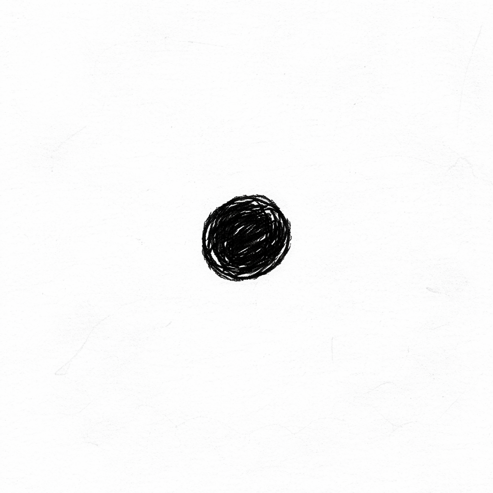
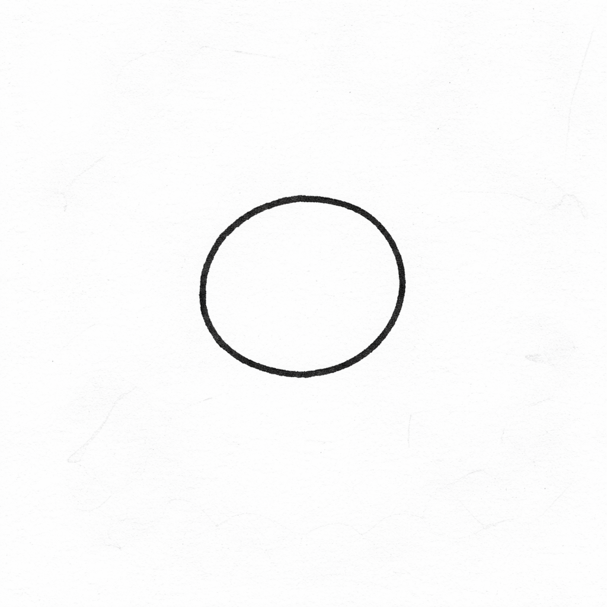
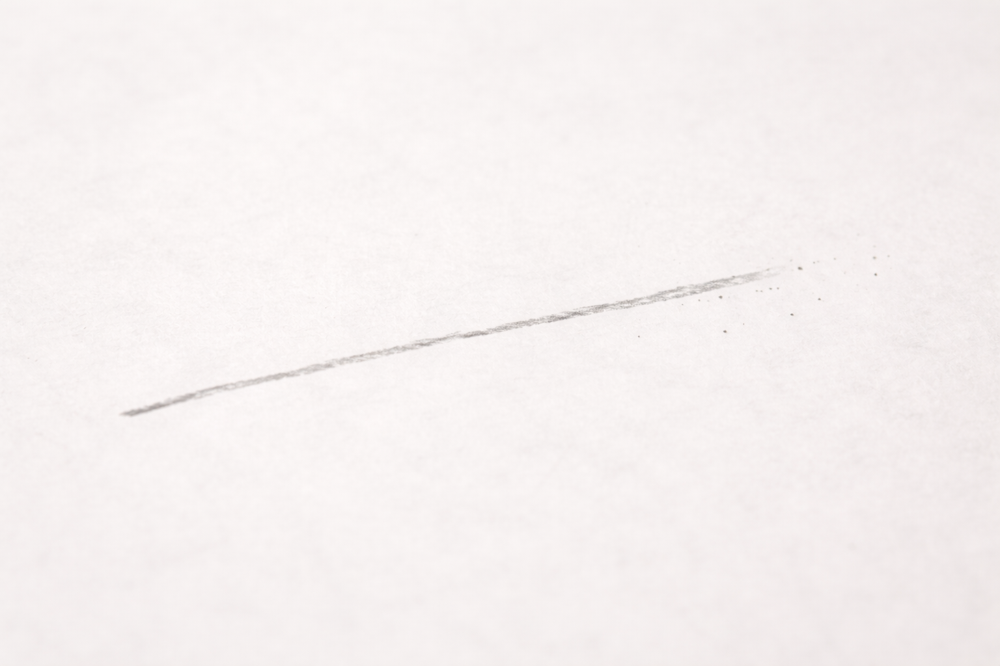
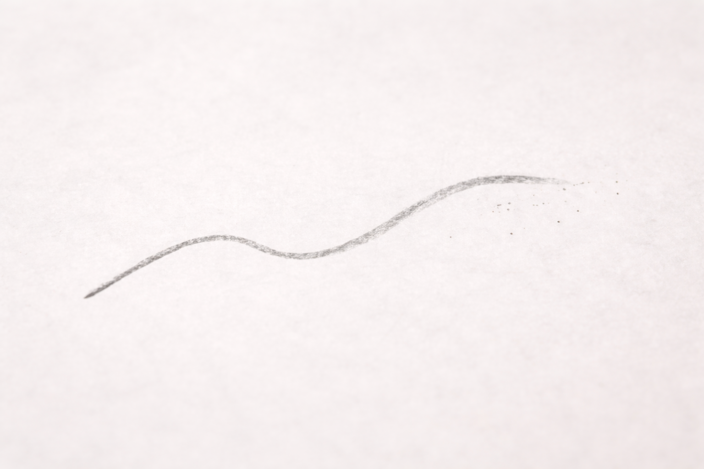
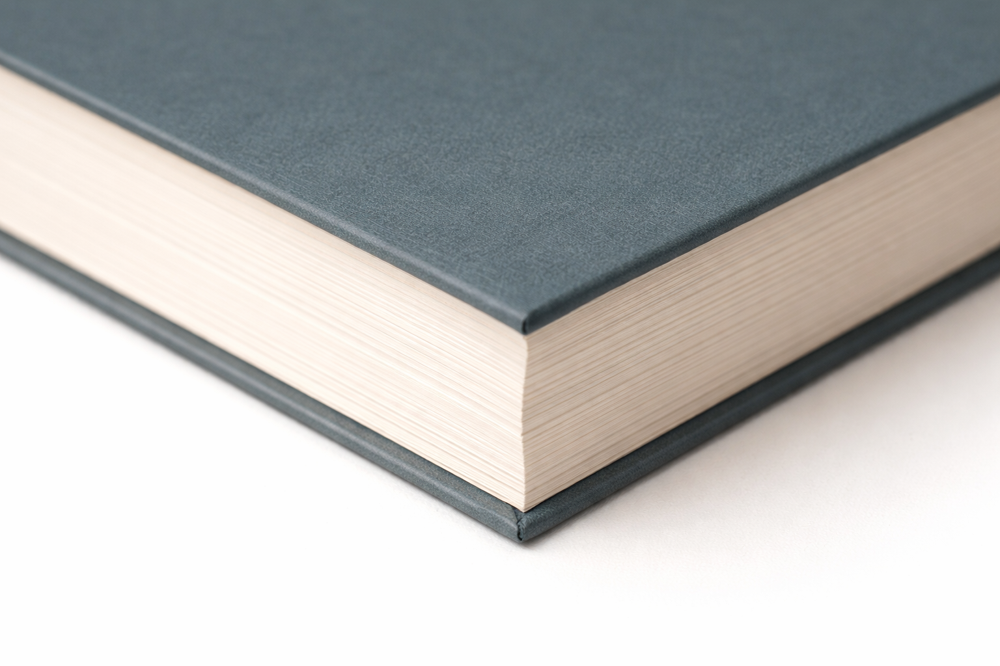

# Game 1: What Can I Do With Two Points?

Euclid's first game challenges us to explore what we can do with just two points. This is the foundation of all geometry, as points are the most basic building blocks.
We need to understand a few of the definitions and rules of the game before we can start playing, and we also need to be able to agree on what it means to play the game fairly.
These concepts, referred to by Euclid as "definitions", "postulates", and "common notions", were introduced in full in the introduction.
You should have gotten a chance to glance at those, but it is in these games that we will actually take the leap to understand them more fully and see how they work in practice.

## Definition 1: Points

The first definition in Euclid's Elements states:

> A *point* is that which has no part.

Take out a piece of paper and draw a dot.

Now draw a circle:

Finally, touch the tip of your pen or pencil.

::: {.callout-note .discussion-box title="Discussion"}
Which of these is a point? Which is not? Why?
:::

## Definition 2: Lines

On to our second definition for this game:

> A *line* is breadthless length.

First, let's talk about the word "breadthless". It means that a line has no width. It is so thin that it looks like.

::: {.callout-note .discussion-box title="Discussion"}
What does it mean for something to have no width? Can you imagine something that has length but no width?
:::

These are games that mathematicians, engineers, scientits, artists, and philosphers have been playing for thousands of years! Sometimes, we have to come up with something that isn't really how the world works to help us understand *how* the world works.

Just like before, let's start by having you draw a line on a piece of paper. It will have some width, but we can pretend that it doesn't. We can imagine that it is infinitely thin.

Next, let's draw a curved line. Go ahead and have some fun with it:

Do you have a book nearby? Look at the edges of the book's cover and its pages. What do they look like?

::: {.callout-note .discussion-box title="Discussion"}
Which of these are lines? Which are not? Why?
:::

## Definition 3:

## The Game

Euclid says that the game is to

> On a given finite straight line to construct an equilateral triangle.

In other words, we need to make a triangle with three equal sides using only a straight line segment as our starting point.

<iframe
scrolling="no"
title="Euclid Proposition I"
src="https://www.geogebra.org/material/iframe/id/rnufypja/width/700/height/500/border/888888/sfsb/true/smb/false/stb/false/stbh/false/ai/false/asb/false/sri/false/rc/false/ld/false/sdz/true/ctl/false"
width="700px"
height="500px"
style="border:4px;">
</iframe>